<!-- ============================================================
     SHRUTIK KAPATEL - GitHub Profile README
     Terminal / embedded firmware aesthetic
     ============================================================ -->

<div align="center">

<!-- Animated typing header -->


<br/>

<!-- Animated terminal window -->


[](https://shrutik-kapatel.github.io)
[](mailto:ka.patelshrutik37@gmail.com)
[](https://linkedin.com/in/shrutik-kapatel)

</div>

---

## `$ cat about_me.txt`

```c
typedef struct {
    char  *name;
    char  *degree;
    char  *focus;
    char  *platform;
    char  *status;
} Engineer_t;

Engineer_t shrutik = {
    .name     = "Shrutik KaPatel",
    .degree   = "MEng Electrical Engineering - Carleton University",
    .focus    = "Bare-metal firmware, digital hardware design",
    .platform = "STM32F407 (ARM Cortex-M4)",
    .status   = "Open to embedded firmware & hardware roles"
};
```

I write firmware close to the metal - register-level peripheral drivers, interrupt-driven architectures, and DMA pipelines. My work lives in C, on real hardware, without an OS getting in the way.

---

## `$ ls ./skills/`

<div align="center">

<!-- COLOR SYSTEM:
     Cyan  #00FFFF / labelColor=0D1117  — primary firmware skills (things you own)
     Blue  #4A9EFF / labelColor=0D1117  — digital hardware
     Slate #8B9BB4 / labelColor=1A1A2E  — toolchain / support
     Dim   #3D4450 / labelColor=1A1A2E  — secondary / learning
-->

### ⚙️ Core Platform


### 🔌 Protocols & Peripherals


### 🖥️ Digital Hardware


### 🛠️ Debug & Toolchain


</div>

---

## `$ ls ./projects/ --sort=impact`

### 🔴 [`STM32F407 Bare-Metal Firmware Suite`](https://shrutik-kapatel.github.io)
```
Platform  : STM32F407VGT6 · ARM Cortex-M4 @ 168 MHz
Lang      : C (bare-metal, no HAL)
Key work  : Register-level GPIO, UART/DMA, SPI, I2C, timer PWM
Debug     : J-Link + logic analyzer validation
Status    : [████████████████████] Active development
```
> Full peripheral driver stack written from scratch against the reference manual. No abstraction layers - pure CMSIS and direct register writes.

---

### 🟡 [`drone-search-rescue-mips32`](https://github.com/Shrutik-KaPatel/drone-search-rescue-mips32)
```
Platform  : MIPS32 (Verilog)
Lang      : Verilog HDL
Key work  : 5-stage pipelined processor, edge preprocessing for drone SAR
Status    : [████████████████████] Complete
```
> Implemented a fully pipelined MIPS32 processor in Verilog to run drone search-and-rescue edge workloads. Hazard detection, forwarding units, and pipeline stall logic included.

---

### 🟢 [`sensor-data-logger`](https://github.com/Shrutik-KaPatel/sensor-data-logger)
```
Platform  : Bare-metal C (STM32 learning series)
Lang      : C
Key work  : Structs, unions, enums for temp/voltage/pressure modeling
Status    : [████████████████████] Complete
```

### 🟢 [`UART-Command-Handler`](https://github.com/Shrutik-KaPatel/UART-Command-Handler)
```
Platform  : Bare-metal C
Lang      : C
Key work  : Linked-list command queue, volatile ISR flags, multi-file extern
Status    : [████████████████████] Complete
```

### 🟢 [`Sensor_data`](https://github.com/Shrutik-KaPatel/Sensor_data)
```
Platform  : Bare-metal C
Lang      : C
Key work  : Dynamic sensor buffer with linked lists, embedded memory patterns
Status    : [████████████████████] Complete
```

---

## `$ cat learning_log.txt`

```
[IN PROGRESS] FreeRTOS task scheduling & semaphores
[IN PROGRESS] Bare-metal DMA pipelines (STM32F4)
[IN PROGRESS] Hardware debugging - J-Link, logic analyzer
[IN PROGRESS] Interrupt-driven driver architecture
[NEXT]        Bootloader implementation (STM32)
[NEXT]        CAN bus protocol
```

---

## `$ ./stats.sh`

<div align="center">


</div>

---

## `$ ping shrutik`

<div align="center">

```
PING shrutik (ka.patelshrutik37@gmail.com)
→ Reply from shrutik: Open to embedded firmware roles
→ Reply from shrutik: Ottawa, ON · Relocation open
→ Reply from shrutik: Response time < 24h
```

[](https://shrutik-kapatel.github.io)
[](mailto:ka.patelshrutik37@gmail.com)

<br/>


</div>

---

<div align="center">
<sub><code>// Last updated: 2026 · Built for embedded systems engineers who read the datasheet first</code></sub>
</div>
